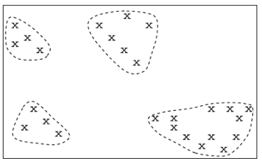

# Data Mining

## What is Data Mining?
Data mining is the extraction of interesting patterns or knowledge from huge amounts of data.    
By interesting, we mean non-trivial, implicit, previously unknown and potentially useful.

Data mining can also go by other names, such as:
- Knowledge discovery
- Knowledge extraction
- Data/pattern analysis
- Information harvesting
- Business intelligence

CRISP-DM would be the common, cross-industry standard process for data mining.

There are many applications of data mining, such as:
- Basket data analysis to targeted marketing
- Recommendation systems
- Mining social network graphs
- Web page analysis
- Advertising on the web
- Biological and medical data analysis
    - Classification
    - Cluster analysis
    - Biological sequence analysis
    - Biological network analysis

## What kinds of data can we mine?
One source would be database-oriented data sets and applications, such as relational databases, data warehouses or transactional databases.

There are also advanced data sets and applications, such as data streams and sensor data, time series data, structured data, graphs, social networks, multimedia databases, text databases and, of course, the Internet.

## Cluster Analysis
usually carried out on unsupervised data (i.e. the class labels are unknown).

This form of analysis can group data to form new categories (i.e. clusters), e.g., cluster houses to find distribution patterns. 

Principle: Maximising intra-class similarity and minimising inter-class similarity.
 
 

<!---->

    

## Classification
Classification and label prediction is where we:
- Construct models (functions) based on some training examples. 
- Describe and distinguish classes or concepts for future prediction
    - E.g. classify contries based in climate
- Predict some unknown class labels

The typical methods used for this type of work include: decision trees, naive Bayesian classification, support vector machines, neural networks, rule-based classification, pattern-based classification, and logistic regression, to name a few.

## Variable types
Given the wide range of data sources, one would expect to encounter a wide range of data variables. These will include:
- Nominal variables
- Binary variables
- Ordinal variables
- Integer variables
- interval-scaled variables
- Ratio-scaled variables

When looking at categorical attributes, we would expect to be working with nominal, binary and ordinal variables. When looking at numeric attributes, we would be expecting to work with integer, continuous (interval-scaled and ratio-scaled) variables. 

Categorical data will looking something like:
| Day | Outlook | Temp | Humidity | Wind | Play |
|-----|---------|------|----------|------|------|
| D1 | Sunny | Hot | High | Weak | No |
| D2 | Sunny | Hot | High | Strong | No |
| D3 | Overcast | Hot | High | Weak | Yes |
| D4 | Rain | Mild | High | Weak | Yes |
| D5 | Rain | Cool | Normal | Weak | Yes |

 
Numerical data will look like:    

| Gender | Height | Weight |
|--------|--------|--------|
| Male | 174 | 96 |
| Male | 189 | 87 |
| Female | 185 | 110 |
| Female | 195 | 104 |
| Male | 149 | 61 |
| Male | 189 | 104 |

## Data Preperation

