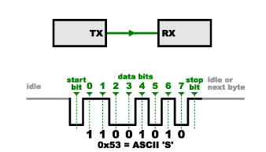

The Arduino write data to the SD card using a common communications protocol called SPI, or Serial Peripheral Interface.

These notes will give a brief overview of how SPI works. 

# Introduction to SPI
Serial Peripheral Interface is an interface bus which is commonly used to send data between a microcontroller and it's peripherals, such as an SD card.

SPI uses separate clock and data lines teamed with a chip-select which allows the user to select which device is talking. So SPI works in a different way to a normal serial port on a PC. The serial port is asynchronous, because there is no control over when data is sent and there is no guarantee that both sides are running at the exact same rate. 

PCs will run off a single clock, which keeps everything synchronised. This can cause problems when some systems are running from slighly different clocks. 

A way to get around this is adding asynchronous serial connections add an extra start and stop bit to each byte, which will help the receiver synch the data as it arrives. Both sides will also agree on the transmission rate - for example, the Arduino would commonly use 9600 bits per second. Any differences that arise in transmission rates are not a massive issue, as the receiver re-synchs at the start of each byte.

The image below hows an SPI set up.

# Sources
https://learn.sparkfun.com/tutorials/serial-peripheral-interface-spi/all