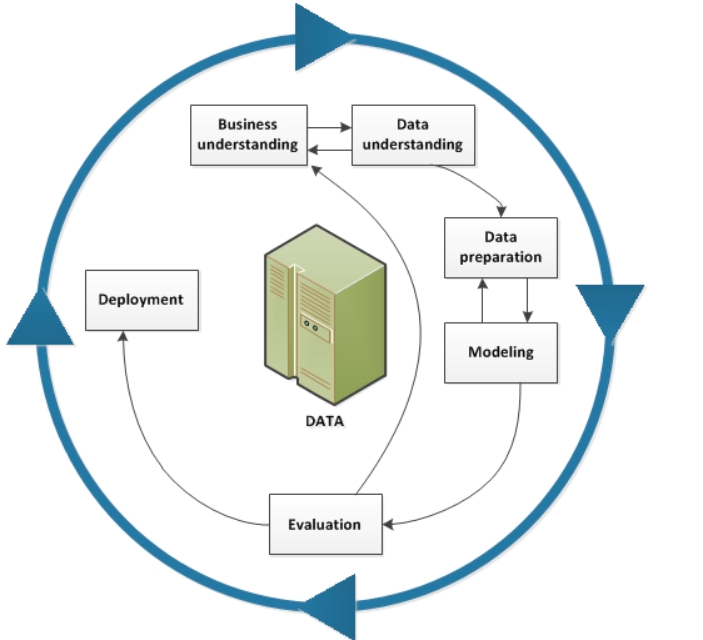

# CRISP-DM Introduction

## Links
The following were used as sources:      
https://www.ibm.com/docs/en/spss-modeler/saas?topic=dm-crisp-help-overview      
https://www.datascience-pm.com/crisp-dm-2/

## Introduction
CRISP-DM stands for **Cross-Industry Standard Process for Data Mining**, and is an inductry proven way to guide data mining projects. It is also generic enough that it can be used for most AI type projects. 

The life-cycle is shown in the diagram below:

The CRISP-DM model can be looked at in two ways. First, as a **methodology**, and second as a **process model**. 

As a methodology, it details the typical phases of a project by providing the tasks involved at each stage, and showing the replations between them. 

As a process model, it provides at high-level view of the data mining life cycle. 

We can see from the above diagram that the model contains six phases, with arrows indicating the paths which are typically followed as one moves through the phases. The main phases are:
- Business understanding
- Data understanding
- Data preperation
- Modelling
- Evaluation
- Deployment

We can see that, for this research project, these phases will tie in with the work to be carried out, with potentially the need for only slight customisation. 

If we take these main phases in turn, we can put general, project specific questions beside each:
- What is the bussines trying to achieve?
- What data is available? What data needs to be collected? Will it need to be cleaned?
- How is the data to be organised for modelling?
- Which models are to be tested? Which gives the best results? Are the results obtained worth the effort?
- How has the deployment worked? What are the results? Did the system work?

The data collection and data preperation phases will be some of the most critical, because if there are issues with the data this could cause problems in the later phases